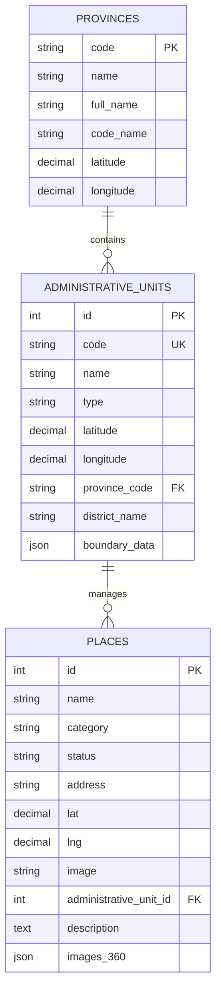

# 🗺️ Tài liệu Tổng hợp Dự án: Bản đồ số địa bàn & Trình xem không gian 360° Phường Duy Hà

Tài liệu này cung cấp cái nhìn toàn diện về kiến trúc, cấu trúc cơ sở dữ liệu, các chức năng cốt lõi, thuật toán sử dụng, cấu trúc thư mục và tiến độ hiện tại của dự án **Bản đồ số địa bàn Phường Duy Hà, Tỉnh Ninh Bình**.

---

## 1. Giới thiệu chung
Dự án **Bản đồ số địa bàn Phường Duy Hà** là một nền tảng bản đồ số chuyên dụng cho phép hiển thị trực quan, quản lý và tra cứu thông tin các cơ quan đoàn thể, tổ dân phố, trường học, bệnh viện, công an... tại địa bàn phường Duy Hà, Tỉnh Ninh Bình (tọa độ trung tâm UBND Phường: `20.6478448, 105.914737`). 

Đồng thời, hệ thống tích hợp trình xem **Không gian 360° Panorama thực tế ảo (VR Tour)** cho phép người dân và ban quản lý tham quan thực tế ảo các góc nhìn sinh động tại các địa điểm hành chính, văn hóa, giáo dục ngay trên ứng dụng mà không cần đến trực tiếp.

---

## 2. Kiến trúc Công nghệ

Hệ thống được xây dựng theo mô hình tách biệt **Frontend** và **Backend (API + Admin Panel)**:

### 2.1. Frontend (SPA)
*   **Môi trường & Đóng gói**: [Vite](https://vite.dev/) + [TypeScript](https://www.typescriptlang.org/) đảm bảo hiệu năng cao, phản hồi nhanh và mã nguồn chặt chẽ.
*   **Thư viện Bản đồ**: [Leaflet.js](https://leafletjs.com/) xử lý hiển thị bản đồ nền, vẽ đa giác địa giới và quản lý các điểm marker địa điểm.
    *   Sử dụng plugin `leaflet.markercluster` để gom nhóm các địa điểm khi thu nhỏ bản đồ, tránh quá tải giao diện hiển thị.
    *   Hỗ trợ chuyển đổi các loại bản đồ nền: Google Roadmap, Google Satellite và Google Clean Roadmap (tối giản không hiển thị địa điểm thương mại).
*   **Giao diện & Hiệu ứng**:
    *   [Tailwind CSS](https://tailwindcss.com/) dùng cho thiết kế responsive, hiệu ứng kính mờ (glassmorphic panels), và các chuyển động vi mô (micro-animations).
    *   [Swiper.js](https://swiperjs.com/) xây dựng thanh trượt Carousel hiển thị danh sách các địa điểm ở dưới cùng màn hình.
    *   [Driver.js](https://driverjs.com/) cung cấp tính năng hướng dẫn tương tác (Interactive Tour) tự động kích hoạt cho người dùng mới truy cập lần đầu.
*   **Không gian thực tế ảo 360°**:
    *   [Pannellum](https://pannellum.org/) tích hợp trình xem ảnh toàn cảnh 360 độ (Panorama Equirectangular) để người dùng tham quan không gian thực tế ảo tại địa điểm.
*   **Dịch vụ thời tiết**:
    *   [Open-Meteo API](https://open-meteo.com/) tích hợp hiển thị thời tiết thực tế (nhiệt độ, độ ẩm, sức gió) tại Phủ Lý, Hà Nam.

### 2.2. Backend (API & Admin Dashboard)
*   **Framework chính**: [Laravel Framework](https://laravel.com/) (PHP) làm nền tảng xử lý logic nghiệp vụ và cung cấp RESTful API cho frontend.
*   **Trang quản trị (Admin Panel)**: [Filament v3](https://filamentphp.com/) xây dựng giao diện quản lý dữ liệu địa điểm, ảnh 360 độ panorama và địa giới hành chính.
*   **Cơ sở dữ liệu**: MySQL lưu trữ thông tin có cấu trúc và tọa độ không gian địa lý.

---

## 3. Cấu trúc Cơ sở dữ liệu (Database Schema)

Hệ thống bao gồm các bảng dữ liệu cốt lõi sau:

### 3.1. Bảng `provinces` (Tỉnh/Thành phố toàn quốc)
Lưu trữ danh sách các tỉnh thành Việt Nam phục vụ việc phân cấp quản lý địa giới hành chính.
*   `code`: Khóa chính (string, dạng mã tỉnh ví dụ: `37` - Ninh Bình, `35` - Hà Nam...).
*   `name`: Tên tỉnh.
*   `full_name`: Tên đầy đủ.
*   `code_name`: Tên không dấu dạng snake_case.
*   `latitude`, `longitude`: Tọa độ trung tâm của tỉnh.

### 3.2. Bảng `administrative_units` (Đơn vị hành chính cấp xã)
Lưu trữ thông tin địa giới hành chính của các xã/phường/thị trấn.
*   `id`: Khóa chính (BIGINT).
*   `code`: Mã xã/phường GSO duy nhất (string).
*   `name`: Tên đơn vị hành chính (ví dụ: Phường Duy Hà).
*   `type`: Phân loại (Phường, Xã, Thị trấn).
*   `latitude`, `longitude`: Tọa độ trung tâm của xã.
*   `link`: Liên kết Google Maps.
*   `province_code`: Khóa ngoại liên kết với `provinces.code`.
*   `district_name`: Tên quận/huyện quản lý.
*   `boundary_data`: Cột kiểu dữ liệu JSON, lưu GeoJSON Polygon hoặc MultiPolygon ranh giới địa lý.

### 3.3. Bảng `places` (Địa điểm địa bàn)
Bảng chứa thông tin cốt lõi về các địa điểm của phường Duy Hà.
*   `id`: Khóa chính.
*   `name`: Tên địa điểm (ví dụ: Ủy ban Nhân dân Phường Duy Hà, Trường Tiểu học Duy Hà...).
*   `category`: Phân loại địa điểm:
    *   `government`: Cơ quan hành chính / Đoàn thể (Màu đỏ, Icon: `corporate_fare`)
    *   `school`: Trường học / Giáo dục (Màu xanh lá, Icon: `school`)
    *   `health`: Y tế / Bệnh viện (Màu hồng, Icon: `medical_services`)
    *   `police`: Công an / An ninh (Màu xanh dương, Icon: `local_police`)
*   `status`: Trạng thái hoạt động (`active` hoặc `inactive`).
*   `address`: Địa chỉ chi tiết.
*   `lat`, `lng`: Tọa độ địa lý chính xác phục vụ hiển thị marker trên bản đồ.
*   `image`: Đường dẫn ảnh đại diện địa điểm.
*   `administrative_unit_id`: Khóa ngoại liên kết tới bảng `administrative_units` để lọc theo khu vực.
*   `description`: Nội dung mô tả chi tiết về địa điểm.
*   `images_360`: Cột dạng JSON, lưu danh sách các cảnh ảnh 360 độ (tiêu đề, phân loại upload/url, đường dẫn tệp hoặc url ngoài).

### 3.4. Mối quan hệ giữa các bảng (Entity Relationship Diagram)


---

## 4. Các RESTful API Endpoints chính

Frontend giao tiếp với Backend thông qua các API sau (được khai báo tại `admin-laravel/routes/api.php`):

### 4.1. Lấy danh sách các địa điểm
*   **Endpoint**: `GET /api/places`
*   **Mô tả**: Trả về toàn bộ danh sách các địa điểm trên bản đồ kèm mảng ảnh 360 độ panorama (`images_360`).

### 4.2. Lấy chi tiết một địa điểm
*   **Endpoint**: `GET /api/places/{id}`
*   **Mô tả**: Trả về thông tin chi tiết của địa điểm cùng ranh giới hành chính liên kết.

### 4.3. Lấy danh sách tỉnh thành
*   **Endpoint**: `GET /api/provinces`
*   **Mô tả**: Trả về danh sách tất cả các tỉnh thành toàn quốc bao gồm mã tỉnh, tên và tọa độ trung tâm.

### 4.4. Lấy danh sách xã phường theo tỉnh
*   **Endpoint**: `GET /api/provinces/{code}/wards`
*   **Mô tả**: Trả về danh sách xã phường thuộc tỉnh có mã `{code}` để lọc địa điểm.

### 4.5. Lấy GeoJSON ranh giới tỉnh (Lazy Load Province Boundary)
*   **Endpoint**: `GET /api/provinces/{code}/boundary`
*   **Mô tả**: Trả về tệp GeoJSON chứa ranh giới địa lý chi tiết của tỉnh để vẽ nét ranh giới bao quanh tỉnh.

### 4.6. Lấy chi tiết xã phường kèm ranh giới GeoJSON (Lazy Load Ward Boundary)
*   **Endpoint**: `GET /api/administrative-units/{id}`
*   **Mô tả**: Trả về thông tin chi tiết và dữ liệu ranh giới địa lý GeoJSON (`boundary_data`) của một xã phường cụ thể phục vụ vẽ vùng bao phủ đa giác của xã được chọn (vẽ ranh giới Phường Duy Hà).

### 4.7. API proxy phục vụ File tĩnh (Storage)
*   **Endpoint**: `GET /api/storage/{path}`
*   **Mô tả**: Đọc và trả về file ảnh tĩnh từ thư mục lưu trữ private, tự động thêm các CORS header để cho phép frontend gọi ảnh WebGL (dựng ảnh 360 độ Panorama bằng Pannellum không bị lỗi bảo mật CORS).

---

## 5. Các Cơ chế & Thuật toán Cốt lõi

### 5.1. Thuật toán Ray-Casting (Tự động xác định địa giới)
Khi quản trị viên nhập tọa độ (Vĩ độ, Kinh độ) cho địa điểm trong Filament Admin Panel, hệ thống sẽ tự động tìm kiếm xem tọa độ đó nằm gọn trong ranh giới địa lý của Phường/Xã nào để gán khóa ngoại `administrative_unit_id` tự động.

Thuật toán được cài đặt tại `App\Services\GeoService::isPointInPolygon` theo nguyên lý Ray-Casting: Bắn một tia ngang từ điểm cần kiểm tra và đếm số lần cắt các cạnh của đa giác ranh giới. Nếu số lần cắt là số lẻ, điểm đó nằm trong đa giác.

### 5.2. Quản lý Vòng đời Tệp tin Tự động (File Lifecycle Cleanup)
Thông qua các Eloquent Model Events (`saving`, `deleting`) trong `App\Models\Place`:
1.  **Khi cập nhật hình ảnh**: Tự động xóa các file ảnh cũ trên ổ cứng (ảnh đại diện cũ, ảnh 360 độ bị loại bỏ) để tránh tình trạng lưu trữ tệp rác.
2.  **Khi xóa địa điểm**: Tự động dọn dẹp sạch sẽ toàn bộ các ảnh liên quan ra khỏi ổ đĩa Storage nhằm bảo vệ dung lượng lưu trữ của máy chủ.

---

## 6. Cấu trúc Thư mục Dự án

```text
PhilanthropyMap/
├── index.html                    # Giao diện chính của ứng dụng Frontend SPA
├── package.json                  # Cấu hình dependencies frontend (Leaflet, Swiper, v.v.)
├── tsconfig.json                 # Cấu hình TypeScript compiler
├── vite.config.ts                # Cấu hình build frontend bằng Vite
├── src/                          # Mã nguồn Frontend
│   ├── main.ts                   # Logic cốt lõi: Khởi tạo bản đồ, marker cluster, sự kiện lọc, widget, VR 360 Tour...
│   ├── style.css                 # CSS chứa các tùy biến giao diện mờ và hoạt ảnh nhấp nháy
│   ├── data/                     # Thư mục chứa dữ liệu tĩnh
│   ├── services/                 # Các dịch vụ bên ngoài (weather.ts lấy thời tiết)
│   └── types/                    # Định nghĩa kiểu dữ liệu TypeScript (index.ts)
└── admin-laravel/                # Mã nguồn Backend Laravel (Admin Panel & API)
    ├── app/
    │   ├── Models/               # Định nghĩa các bảng CSDL (Place.php, AdministrativeUnit.php, Province.php)
    │   ├── Services/             # Chứa GeoService.php xử lý thuật toán xác định xã phường theo tọa độ
    │   └── Filament/             # Cấu hình Admin Dashboard bằng Filament v3
    │       └── Resources/        # Bộ quản trị Places, AdministrativeUnits
    ├── database/
    │   ├── migrations/           # Các file khởi tạo và thay đổi cấu trúc bảng
    │   └── seeders/              # Chứa DatabaseSeeder.php nạp dữ liệu mẫu ban đầu
    ├── routes/
    │   ├── api.php               # Khai báo các API Endpoints cho frontend gọi
    │   └── web.php               # Khai báo các route web (mặc định chuyển sang admin)
```

---

## 7. Hướng dẫn Khởi chạy Dự án

Để chạy toàn bộ dự án dưới môi trường phát triển (Local), thực hiện các bước sau:

### Bước 1: Khởi động Backend (Laravel)
1.  Di chuyển vào thư mục backend:
    ```bash
    cd admin-laravel
    ```
2.  Cài đặt các thư viện PHP qua Composer:
    ```bash
    composer install
    ```
3.  Cấu hình tệp tin môi trường `.env` (thiết lập kết nối cơ sở dữ liệu MySQL).
4.  Khởi tạo database và chạy seeder nạp dữ liệu mẫu:
    ```bash
    php artisan migrate:fresh --seed
    ```
5.  Khởi chạy máy chủ API:
    ```bash
    php artisan serve --port=8005
    ```
    *API sẽ chạy mặc định tại `http://127.0.0.1:8005`.*

### Bước 2: Khởi động Frontend (SPA)
1.  Mở một cửa sổ dòng lệnh mới tại thư mục gốc của dự án (`PhilanthropyMap/`).
2.  Cài đặt các thư viện JavaScript:
    ```bash
    npm install
    ```
3.  Khởi chạy máy chủ phát triển frontend:
    ```bash
    npm run dev
    ```
    *Giao diện bản đồ người dùng sẽ chạy tại `http://localhost:5174`.*

---

## 8. Trạng thái Dự án & Lộ trình Phát triển

> [!NOTE]
> Mục này ghi lại trạng thái thực tế và tiến độ công việc. Mỗi khi mở lại dự án hoặc thay đổi logic, hãy cập nhật mục này để biết dự án đang dừng lại ở đâu.

### 📊 Trạng thái Hiện tại (Đã hoàn thành)
*   **Bản đồ địa bàn Phường Duy Hà**:
    *   Tự động ghim các Marker của các nhóm địa điểm (Cơ quan hành chính, Trường học, Y tế, Công an) với các bộ icon Material Design được phong cách hóa riêng biệt cho Phường Duy Hà.
    *   Vẽ ranh giới địa lý bao phủ Phường Duy Hà, Ninh Bình dựa trên dữ liệu GeoJSON động từ API xã phường.
    *   Dropdown tìm kiếm địa điểm và khu vực hoạt động nhanh chóng, không giật lag.
*   **Thống kê Dashboard**:
    *   Tổng số địa điểm.
    *   Số lượng Trường học & Y tế.
    *   Số lượng Hành chính & An ninh.
*   **Trình xem VR Không gian 360° Panorama**:
    *   Khi người dùng click chọn địa điểm hoặc bấm nút "Xem 360°" trên thẻ carousel địa điểm, sidebar sẽ mở ra.
    *   Tab "Không gian 360°" tích hợp Pannellum WebGL Viewer để tự động nạp ảnh panorama equirectangular 360 độ của địa điểm đó.
    *   Tự động hiển thị các nút chuyển đổi góc nhìn (Viewpoint Selector) nếu địa điểm được thiết lập nhiều hình ảnh panorama 360°.
*   **Dịch vụ nền**:
    *   Widget hiển thị thời tiết thực tế ở Phủ Lý, Hà Nam.
    *   Bản đồ hỗ trợ các bản đồ nền Google Roadmap, Google Satellite và Google Clean.
*   **Biên dịch & Chạy thử**:
    *   Chạy thành công frontend (`npm run dev`) trên cổng `5174`.
    *   Chạy thành công backend API (`php artisan serve`) trên cổng `8005`.
    *   Biên dịch thành công production bundle (`npm run build`) mà không gặp bất kỳ lỗi TypeScript hay Vite build nào.
